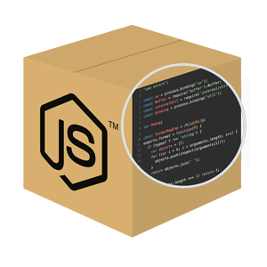
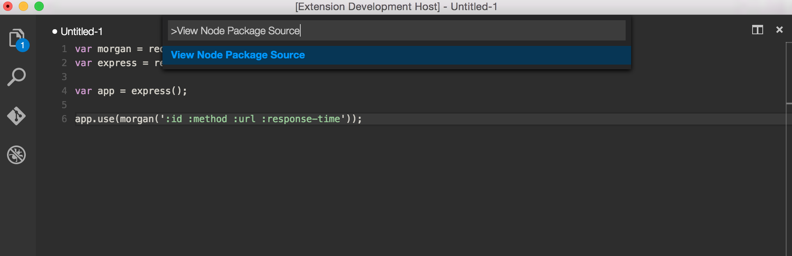

# View Node Package - Visual Studio Code Extension

How often were you in the position that you are writing some Node.JS code and you can't remember
something about a package that you are using. You end up switching to your browser, look up the
the NPM package and then navigate to the repository.

**This extension allows you to instantly switch from VS Code to the repository or documentation of
the respective package. **

# How to use 

1. Navigate to the line where you `require(...)` the package.

2. Run the `View Node Package Source` command.


3. If you selected multiple `require` statements or a line without one, the extension will scan the document and offer you options.


4. Enjoy browsing the Node.JS documentation, for native packages, or the repository, for NPM packages. 

# How to contribute

1. Download source code and install dependencies 
```
git clone git@github.com:dkundel/vscode-npm-source.git
cd vscode-npm-source
npm install
code .
```
2. Make the respective code changes.
3. Go to the debugger in VS Code, choose `Launch Extension` and click run. You can test your changes.
4. Choose `Launch Tests` to run the tests.
5. Submit a PR.

# Backlog

  - Add TypeScript 'import' syntax.
  - Add UTs

# Contributors

[Dominik Kundel](https://github.com/dkundel)

# License

MIT